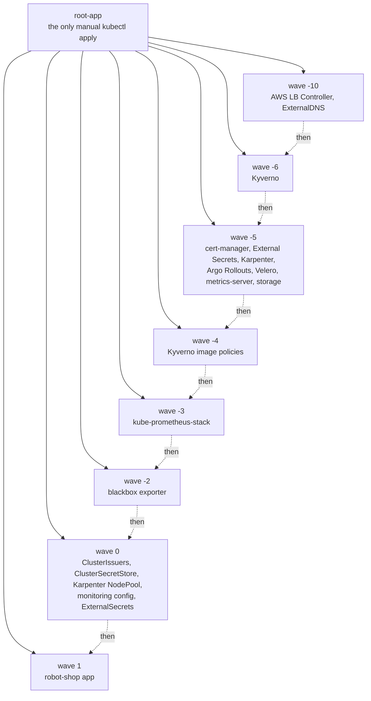

# robot-shop-gitOps

[](https://github.com/charliepoker/robot-shop-gitOps/actions/workflows/monitoring-validate.yml)

The Kubernetes side of a three-repo AWS platform. **Everything running on the EKS cluster is declared in this repo and reconciled by Argo CD.** After one manual `kubectl apply` of the root app, nothing else is applied by hand, and manual edits to the cluster are reverted automatically.

> **Status (Oct 2026):** platform, application, supply-chain enforcement and observability layers are built. The AWS environment is **torn down to control cost**, so any `*.devopsportfolio.com` URL is offline. It rebuilds from these repos. See [Limitations](#limitations-and-roadmap) for what is not done.

## The three repos

| Repo | Role |
|---|---|
| [robot-shop-infra](https://github.com/charliepoker/robot-shop-infra) | Terraform: VPC, EKS, RDS MySQL, ECR, Route 53, ACM, KMS, Secrets Manager, GitHub OIDC |
| **robot-shop-gitOps** (this repo) | Argo CD app-of-apps: platform tools, admission policy, observability, app manifests |
| [robot-shop](https://github.com/charliepoker/robot-shop) | App code and the CI/CD pipeline that signs images and bumps tags in this repo |

## How it fits together



Argo CD syncs lower waves first and waits for each to be healthy. The order encodes dependencies: Kyverno and its policies are up **before** the app so images are verified from the first deploy, and operators with CRDs (cert-manager, External Secrets, Karpenter) land before the resources that need those CRDs.

## Bootstrap order

1. Terraform builds the cluster and AWS dependencies ([robot-shop-infra](https://github.com/charliepoker/robot-shop-infra)).
2. Install Argo CD with Helm using `argocd/argocd-values.yaml`.
3. `kubectl apply -f argocd/root-app.yaml`. This discovers every Application under `argocd/apps/` (recursively) and syncs them in wave order.

`root-app` runs with `prune: true` and `selfHeal: true`. Deleting a file under `argocd/apps/` removes that app and its resources, and any drift from `main` is reverted.

## Components

Chart versions are those pinned in each Application manifest.

| Component | Chart | Wave | Why it's here |
|---|---|---|---|
| AWS Load Balancer Controller | 3.4.1 | -10 | Turns Ingress into ALBs; targets pods by IP |
| ExternalDNS | 1.21.1 | -10 | Writes Route 53 records from Ingress hostnames |
| Kyverno | 3.8.1 (app v1.18.1) | -6 | Admission-time image signature verification |
| cert-manager | v1.21.0 | -5 | Certificates; issuers applied in a later app at wave 0 |
| External Secrets Operator | 2.7.0 | -5 | Syncs AWS Secrets Manager into Kubernetes Secrets |
| Karpenter | 1.7.1 | -5 | Node autoscaling; NodePool and EC2NodeClass applied at wave 0 |
| Argo Rollouts | 2.41.0 | -5 | Progressive delivery controller |
| Velero | 12.1.0 | -5 | Cluster backup to S3 |
| metrics-server | 3.13.1 | -5 | Resource metrics for `kubectl top` and future HPAs |
| kube-prometheus-stack | 91.8.2 | -3 | Prometheus, Alertmanager, Grafana, node-exporter, kube-state-metrics |
| blackbox exporter | 11.19.1 | -2 | Synthetic probes of public endpoints |
| robot-shop | manifests | 1 | The application and its in-cluster datastores |

## Supply-chain enforcement

Two Kyverno `ClusterPolicy` resources apply to the `robot-shop` namespace and cover only images from this project's ECR registry:

- **Signature verification: `Enforce`.** The image must carry a Cosign keyless signature from the `robot-shop` repo's `cd.yml` on `master`, issued via GitHub's OIDC provider. An unsigned or differently-signed image is rejected at admission.
- **SBOM attestation verification: `Audit`.** Violations are recorded in PolicyReports but not blocked.

Why two policies and why SBOM is `Audit`: the `ratings` image's full CycloneDX SBOM was 2.9 MB, over Kyverno's ~2 MiB admission processing limit. Admission failed with "context size limit exceeded", which blocked every sync touching the Deployment ([#40](https://github.com/charliepoker/robot-shop-gitOps/pull/40)). Setting `Audit` on just the SBOM rule inside a combined policy had no effect, because Kyverno ignored the per-rule setting ([#41](https://github.com/charliepoker/robot-shop-gitOps/pull/41), [#42](https://github.com/charliepoker/robot-shop-gitOps/pull/42)). Splitting into separate policies kept signature checking strict while the SBOM check became non-blocking. Trade-off: SBOM attestations are not enforced at admission.

## Secrets

No secret values live in this repo. AWS Secrets Manager is the store; External Secrets Operator reads it through a `ClusterSecretStore` and writes Kubernetes Secrets:

- **Database credentials** for `ratings` and `shipping` (RDS MySQL), plus the RDS master secret and a one-time schema bootstrap Job. See `argocd/manifests/secrets/`.
- **Alertmanager's Slack webhook** and the **Grafana admin password**. See `argocd/manifests/monitoring-secrets/`.

Rotation is a Secrets Manager change plus an ESO refresh. Apps that read env vars at startup (`ratings` caches them at compile time) also need a rollout restart.

## Observability

Prometheus, Alertmanager and Grafana come from `kube-prometheus-stack`. Prometheus keeps 15 days of data on a 20 Gi gp3 volume. **Prometheus is public but sits behind ALB authentication with a Cognito user pool.** Grafana uses its own login with the admin password delivered by ESO.

What is committed under `argocd/manifests/monitoring/`:

- **Dashboards:** Argo CD, Kubernetes Views (global and namespaces), Node Exporter Full. They are manifests in this repo, so a rebuild has no dependency on grafana.com.
- **Scrape config:** ServiceMonitors for the app, PodMonitors for the platform components and Argo CD.
- **Synthetic probe:** a blackbox `Probe` on the public endpoints. Robot Shop exposes no request-level metrics, so availability and latency are measured from the outside.
- **11 custom alert rules**, added only where the stack's defaults leave gaps: `ShopDown`, `ShopSlow`, `PublicEndpointDown`, `PublicEndpointCertificateExpiringSoon`, `CertManagerCertificateNotReady`, `CertManagerCertificateExpiringSoon`, `ExternalSecretNotSynced`, `VeleroBackupFailed`, `RolloutAbortedOrFailed`, `RobotShopPodCrashLooping`, `ContainerNearMemoryLimit`.

**Alert routing:** `warning` and `critical` alerts go to Slack. `info` and the always-firing `Watchdog` go to a null receiver, so the stack's ~139 default rules don't flood the channel.

**OpenTelemetry was deliberately not deployed.** None of the services emit traces and there is no trace backend, so a Collector would add cost and moving parts with no signal. Instrumenting one service and adding a trace store is the next step if that changes.

### Validation in CI

The `monitoring-validate` workflow runs `scripts/check-monitoring.sh` on pull requests. It checks that:

1. every YAML under `argocd/apps` and `argocd/manifests` is a real Kubernetes object (a stray non-manifest file stops the whole Application from rendering, which has happened three times, always one folder off, hence "only these folders are watched");
2. alert rules pass `promtool check` and the unit tests in `tests/monitoring/`;
3. the Alertmanager config passes `amtool check-config`, and routing decisions are asserted (a critical alert must reach Slack, `Watchdog` must not).

`promtool` and `amtool` are pinned releases with SHA-256 verification.

## Cost choices

- **Karpenter** may use Spot or On-Demand, restricted to `t` and `m` families, medium to xlarge, capped at 20 vCPU and 40 GiB across the pool. Consolidation (`WhenEmptyOrUnderutilized`) runs after 1 minute, and nodes expire after 30 days.
- **gp3** storage class for all volumes.
- Single replicas for Kyverno, Prometheus and the controllers. This is a deliberate demo-sizing choice (see Limitations).

## Repository layout

```
argocd/
  argocd-values.yaml        # Helm values for installing Argo CD itself
  root-app.yaml             # the app-of-apps root
  apps/                     # one Application per component (watched by root-app)
  manifests/
    robot-shop/             # app Deployments, Services, Ingress, analysis template
    secrets/                # ExternalSecrets for app credentials, RDS bootstrap job
    monitoring/             # dashboards, rules, probes, ServiceMonitors, PodMonitors
    monitoring-secrets/     # ExternalSecrets for Slack webhook and Grafana admin
    kyverno/                # image verification policies
    karpenter/              # NodePool and EC2NodeClass
    cert-manager/           # ClusterIssuers
    external-secrets/       # ClusterSecretStore
    storage/                # gp3 StorageClass
scripts/check-monitoring.sh # local + CI validation
tests/monitoring/           # promtool unit tests for the alert rules
```

Only `argocd/apps/` and `argocd/manifests/` are watched by Argo CD. Anything else in the repo is ignored by the cluster.

## Limitations and roadmap

Stated plainly, so you don't have to discover them.

- **The cluster is offline.** Torn down to stop the AWS bill; rebuild is from these repos plus the infra repo.
- **Backups are not proven.** Velero is installed with an S3 backup location, but no backup schedule is defined here and a restore has never been tested. Treat disaster recovery as not done.
- **Canary delivery is partial.** Argo Rollouts is installed. An analysis template and canary Service for `web` are committed, but `web` still runs as a plain Deployment. Finishing the Rollout conversion is next.
- **No reliability hardening yet.** No HPAs, PodDisruptionBudgets, topology spread or NetworkPolicies, and no chaos or failure-injection testing.
- **Single points of failure by design.** One Kyverno admission replica, one Prometheus, one NAT gateway (infra repo). Production would run these highly available.
- **SBOM attestations are audited, not enforced** (see Supply-chain enforcement).
- **Alerting relies on external probes for user-facing health**, since the app exports no request metrics.